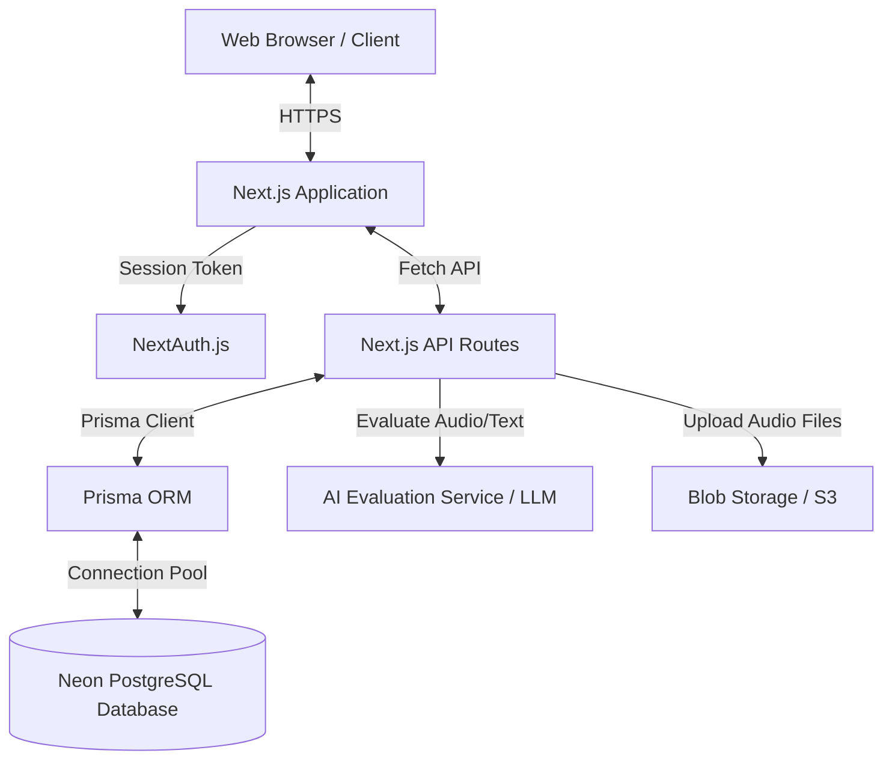

# System Architecture Document

**Project Name:** PrepFly (PTE Practice Platform)
**Version:** 1.0

---

## 1. System Overview
PrepFly is built as a monolithic Next.js 14 application utilizing the App Router. It leverages Server-Side Rendering (SSR) and React Server Components (RSC) for performance and SEO, with Next.js API Routes serving as the backend layer. The data layer is handled by Prisma ORM connecting to a Serverless PostgreSQL database hosted on Neon.

---

## 2. High-Level Architecture



---

## 3. Tech Stack Details

### 3.1. Frontend
- **Framework:** Next.js 14 (React 18)
- **Styling:** Tailwind CSS combined with a custom CSS variables system (`globals.css`) to enforce the "High-End Visual Design" (glassmorphism, fluid animations).
- **UI Components:** `shadcn/ui` (customized heavily for aesthetics), Radix UI primitives.
- **Icons:** `lucide-react`.
- **State Management:** React Context API for global state (e.g., Auth, Theme) and local component state for complex interactive forms (like the Mock Test engine).

### 3.2. Backend (API Layer)
- **Framework:** Next.js Route Handlers (`app/api/*`).
- **Authentication:** NextAuth.js configured with JWT session strategies. Secures endpoints and manages Role-Based Access Control (RBAC).
- **Data Fetching:** Hybrid approach using Server Components for initial load data and client-side `fetch`/SWR for dynamic interactions.

### 3.3. Database Layer
- **Database Engine:** PostgreSQL (Neon Serverless).
- **ORM:** Prisma (`prisma/schema.prisma`).
- **Connection Management:** Uses Prisma Client. **Note:** Special care is needed for Neon connection limits during build/deploy cycles (mitigated by setting appropriate connection pooling settings).

---

## 4. Core Data Models

The Prisma schema is centered around users, organizations (Centres), and the PTE test structures.

- **`User`**: Core identity. Contains fields for `role` (`STUDENT`, `CENTRE_ADMIN`, `SUPER_ADMIN`, `SUB_AGENT`) and a relation to `Centre` (if applicable).
- **`Centre`**: Represents a B2B client institution. Contains branding details and subscription limits.
- **`MockTestTemplate`**: A blueprint created by Super Admins defining the structure, sections, and questions of a mock test.
- **`MockTest`**: An instance of a template assigned to or started by a `Student`. Tracks the `status` (`NOT_STARTED`, `IN_PROGRESS`, `COMPLETED`), timer, and overall scores.
- **`Attempt`**: Records a student's answer to a specific question within a `MockTest` or Practice session. Stores the raw text, audio URL, and the breakdown of AI-generated scores (e.g., Fluency, Pronunciation).

---

## 5. Security & Authorization

- **JWT Sessions:** NextAuth stores session data in HTTP-only cookies.
- **Role-Based Access Control (RBAC):**
  - **Middleware:** Next.js Middleware (`middleware.ts`) protects routes like `/dashboard` and redirects unauthenticated users to `/login`.
  - **API Protection:** Every protected API route verifies the session and checks the `user.role`.
  - **Data Isolation:** Centre Admins querying `/api/users` automatically have a `where: { centreId: session.user.centreId }` filter applied via Prisma.

---

## 6. AI Evaluation Flow
The core value proposition relies on analyzing user input (audio or text) and returning PTE-standardized scores.

1. **Submission:** Student records audio via the browser's MediaRecorder API or types an essay.
2. **Upload (Audio):** The audio Blob is uploaded to a cloud storage bucket, returning a persistent URL.
3. **Evaluation Request:** The client sends the text or audio URL to the Next.js API route (`/api/evaluate`).
4. **Processing:** The API sends the payload and the specific PTE rubrics (as a prompt) to the AI service (e.g., OpenAI API or specialized Whisper models).
5. **Score Generation:** The AI returns structured JSON containing scores for Fluency, Pronunciation, Grammar, etc.
6. **Persistence:** The Next.js API saves the `Attempt` in the database via Prisma and returns the score card to the client.

---

## 7. Folder Structure

```text
pte-platform/
├── apps/
│   └── web/
│       ├── prisma/             # Database schema & migrations
│       ├── src/
│       │   ├── app/            # Next.js App Router (Pages, Layouts, API Routes)
│       │   │   ├── (auth)/     # Login, Register, Onboarding
│       │   │   ├── (dashboard)/# Main application interfaces (Practice, Mock Tests)
│       │   │   └── api/        # Backend API Route Handlers
│       │   ├── components/     # Reusable UI components (shadcn, forms, cards)
│       │   ├── lib/            # Utilities (Prisma client, NextAuth config, helpers)
│       │   └── hooks/          # Custom React hooks
│       ├── public/             # Static assets (images, fonts, noise textures)
│       ├── tailwind.config.ts  # Tailwind configuration
│       └── next.config.mjs     # Next.js configuration
├── package.json
└── ARCHITECTURE.md             # This document
```
